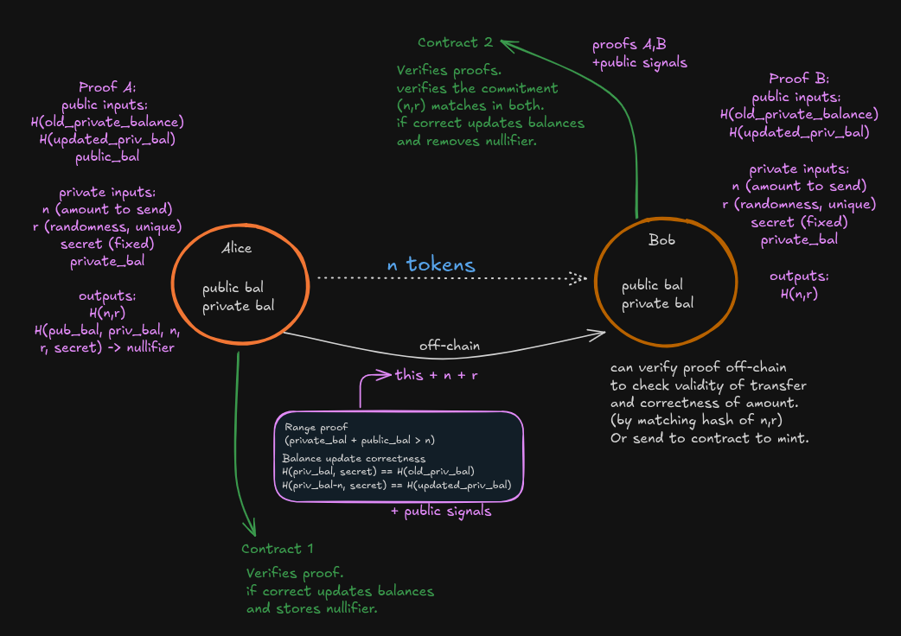

# LOKI

<p>
  <a href="./LICENSE"></a>
  
</p>

Private fund transfers powered by **zero-knowledge proofs**. Enables confidential payments where the transferred amount and sender–receiver linkage remain hidden, while correctness and one‑time spend are enforced on-chain.

Users maintain two balance types:
- **Public Balance:** Visible on-chain
- **Private Balance:** Hidden via Poseidon hash commitments


## Features
- Built on a modified version of EIP‑7503 flow
- No sender/receiver linkage is preserved
- No linkability through IP or timings
- Transferred amount remains private
- Nullifier prevents double spends

## Why Loki
- Previous privacy enhancing protocol were either completely untrackable or a little to public but, loki provides a perfect balance between enhanced privacy and governmental control which none could achieve yet
- Enhances the privacy of users by highly increasing the computation which most people can't do
- Government if wants can track a particular address and its transactions by performing high computations and thus retain the control which will avoid us from getting banned

  
## How it works



At a glance:


- `proof_A` proves Alice honestly deducted `n`
- `proof_B` proves Bob correctly adds `n` to his private balance
- A `nullifier` guarantees each proof can be used only once, No double spend/transfer.

## Quickstart
Below are the minimal steps to run it on localhost. 


1. Install dependencies if it was skipped in CLI:

```
cd loki
yarn install
```

2. Run a local network in the first terminal:

```
yarn chain
```

This command starts a local Ethereum network using Hardhat. The network runs on your local machine and can be used for testing and development. You can customize the network configuration in `packages/hardhat/hardhat.config.ts`.

3. On a second terminal, deploy the test contract:

```
yarn deploy
```

This command deploys a test smart contract to the local network. The contract is located in `packages/hardhat/contracts` and can be modified to suit your needs. The `yarn deploy` command uses the deploy script located in `packages/hardhat/deploy` to deploy the contract to the network. You can also customize the deploy script.

4. On a third terminal, start your NextJS app:

```
yarn start
```

Visit your app on: `http://localhost:3000`.
## Contracts
Contracts live in `./packages/hardhat/contract` . Use a modern Hardhat toolchain. See the folders for tasks such as build, test, and deploy.


### System Architecture

```
┌─────────────────────────────────────────────────────────────┐
│                      Main_Contract                          │
│  • Public/Private Balance Management                        │
│  • Nullifier Tracking (double-spend prevention)             │
│  • Owner: 0xFb93a8DcD5edc3FB6Cb34d77C6811835756c99A0        │
└───────────────┬──────────────────────┬──────────────────────┘
                │                      │
        ┌───────▼─────┐        ┌───────▼─────┐
        │  Burn Path  │        │  Mint Path  │
        └───────┬─────┘        └───────┬─────┘
                │                      │
    ┌───────────▼───────────┐  ┌───────▼─────────────────┐
    │  Burner_Verifier      │  │  Minter_Verifier        │
    │  • Circuit A Proof    │  │  • Circuit A + B Proofs │
    │  • Groth16Verifier    │  │  • Dual Verification    │
    └───────────────────────┘  └─────────────────────────┘

```
### Circuit A: `update_balance.circom` (Burner/Sender Side)

**Purpose:** Proves correct balance state transitions for burn/mint operations.

**Inputs:**

```circom
signal input pub_balance;           // Current public balance
signal input priv_balance;          // Current private balance
signal input new_priv_balance;      // New private balance after operation
signal input r;                     // Randomness for old commitment
signal input r_new;                 // Randomness for new commitment
signal input secret;                // User secret (nullifier preimage)
```

**Outputs (5 public signals):**

```circom
signal output old_commitment;       // Commit(priv_balance, r)
signal output new_commitment;       // Commit(new_priv_balance, r_new)
signal output curr_pub_balance;     // = pub_balance
signal output new_priv_balance_out; // = new_priv_balance
signal output nullifier;            // Hash(secret)
```

**Constraints:**

- Old commitment = Poseidon(priv_balance, r)
- New commitment = Poseidon(new_priv_balance, r_new)
- Nullifier = Poseidon(secret)
- All values properly constrained

**Used by:** `Groth16Verifier` (deployed on-chain)

---

### Circuit B: `proofB.circom` (Minter/Receiver Side)

**Purpose:** Validates transfer amounts using commitment scheme.

**Inputs:**

```circom
signal input priv_balance;          // Current private balance
signal input new_priv_balance;      // New private balance
signal input r;                     // Randomness for old commitment
signal input r_new;                 // Randomness for new commitment
signal input amount;                // Transfer amount
```

**Outputs (3 public signals):**

```circom
signal output old_commitment;       // Commit(priv_balance, r)
signal output new_commitment;       // Commit(new_priv_balance, r_new)
signal output amount_hash;          // Poseidon(amount)
```

**Constraints:**

- Old commitment = Poseidon(priv_balance, r)
- New commitment = Poseidon(new_priv_balance, r_new)
- Amount hash = Poseidon(amount)
- Balance constraints enforced

**Used by:** `Groth16VerifierB` (deployed on-chain)

---

## Security properties
- Privacy: amount, sender, and receiver are not linkable on‑chain
- Integrity: proofs enforce correct balance updates
- Unlinkability: network‑level correlation reduced (no timing/IP linkage in protocol design)
- One‑time spend: nullifiers prevent note reuse
